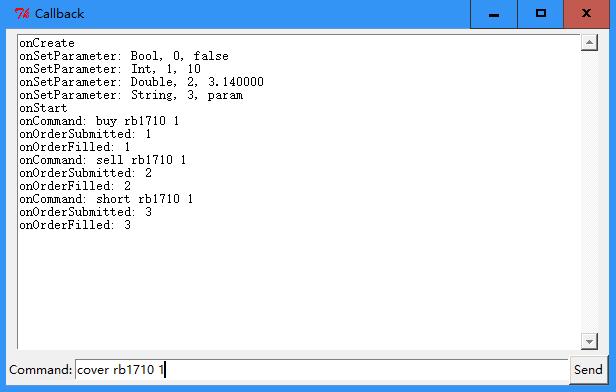

在[这里](<https://github.com/algo-trade/powergate-examples-python>)可以找到更多示例代码。
## Tick
## Bar  
	# -*- coding: utf-8 -*-
	from PowerGate import StrategyBase
	from PowerGate import StrategyConfig
	from PowerGate import Resolution
	
	class BarDemo(StrategyBase):
	    def __init__(self, *args, **kwargs):
	        super(BarDemo, self).__init__(*args, **kwargs)
	
	    def onBar(self, bar):
	        print('Instrument:%s, DateTime:%s, Resolution:%d, Interval:%d' % \
	        (bar.getInstrument(), bar.getDateTime(), bar.getResolution(), bar.getInterval()))
	
	if __name__ == '__main__':
	    config = StrategyConfig()
	    config.setName('BarDemo')
	    config.subscribe('rb1710', Resolution.MINUTE, 1)
	    config.subscribe('ag1712', Resolution.MINUTE, 2)
	    config.subscribe('IF1706', Resolution.SECOND, 5)
	
	    strategy = BarDemo()
	    strategy.run(config)
	
	    raw_input()
	
	    strategy.stop()  
在该示例中，我们在策略的配置中订阅了rb1710、ag1712、IF1706三个合约，周期分别为1分钟、2分钟和5秒钟。  
策略运行之后，我们在终端窗口中将会看到这三个合约的打印信息，时间间隔分别为1分钟、2分钟和5秒钟。
## 指标
## 定时器  
	# -*- coding: utf-8 -*-
	from PowerGate import StrategyBase
	from PowerGate import StrategyConfig
	
	class TimerDemo(StrategyBase):
	    def __init__(self, *args, **kwargs):
	        super(TimerDemo, self).__init__(*args, **kwargs)
	
	    def onStart(self):
	        self.registerTimer(1000)
	
	    def onTimer(self, timerId):
	        print(timerId)
	        self.registerTimer(1000)
	
	if __name__ == '__main__':
	    config = StrategyConfig()
	    config.setName('TimerDemo')
	
	    strategy = TimerDemo()
	    strategy.run(config)
	
	    raw_input()
	
	    strategy.stop()  
我们使用registerTimer()接口注册了一个时间间隔为1000ms的定时器。这个定时器是一次性的，不会周期性的触发，所以在定时器的回调函数中，我们必须重新注册定时器。  
该示例每隔一秒打印一次当前定时器的ID。

## 发送命令
## 回调函数

	# -*- coding: utf-8 -*-
	import logging
	import Tkinter
	from Tkinter import Frame
	from Tkinter import Label
	from Tkinter import Button
	from Tkinter import Entry
	from PowerGate import StrategyBase
	from PowerGate import StrategyConfig
	
	class Callback(StrategyBase):
	    def __init__(self, logger):
	        StrategyBase.__init__(self)
	        self.logger = logger
	
	    def onCreate(self):
	        self.logger.info('onCreate')
	
	    def onSetParameter(self, name, type, value, isLast):
	        self.logger.info('onSetParameter: %s, %d, %s' % (name, type, value))
	
	    def onStart(self):
	        self.logger.info('onStart')
	
	    def onPause(self):
	        self.logger.info('onPause')
	
	    def onResume(self):
	        self.logger.info('onResume')
	
	    def onTick(self, tick):
	        pass
	        #self.logger.info('onTick: %s @ %d %d.%d, price:%d' % 
				(tick.instrument, tick.date, tick.time, tick.millis, tick.lastPrice))
	
	    def onBar(self, bar):
	        self.logger.info('onBar')
	
	    def onOrderSubmitted(self, order):
	        self.logger.info('onOrderSubmitted: %s', order.clOrdId)
	
	    def onOrderRejected(self, order):
	        self.logger.info('onOrderRejected: %s', order.clOrdId)
	
	    def onOrderCancelled(self, order):
	        self.logger.info('onOrderCancelled: %s', order.clOrdId)
	
	    def onOrderFilled(self, order):
	        self.logger.info('onOrderFilled: %s', order.clOrdId)
	
	    def onCommand(self, command):
	        self.logger.info('onCommand: %s' % command)
	        words = command.split()
	        if len(words) == 2:
	            action = words[0]
	            inst = words[1]
	
	            if action == 'sub':
	                self.subscribe(inst)
	                
	            return
	
	        if len(words) == 3:
	            action = words[0]
	            inst = words[1]
	            try:
	                qty = float(words[2])
	            except ValueError:
	                return
	
	            if action == 'buy':
	                self.buy(inst, qty, self.getAskPrice(inst))
	            elif action == 'sell':
	                self.sell(inst, qty, self.getBidPrice(inst))
	            elif action == 'short':
	                self.sellShort(inst, qty, self.getBidPrice(inst))
	            elif action == 'cover':
	                self.buyToCover(inst, qty, self.getAskPrice(inst))
	
	
	    def onStop(self):
	        self.logger.info('onStop')

	class GUI(object):
	    class TextHandler(logging.Handler):
	        def __init__(self, text):
	            logging.Handler.__init__(self)
	            self.text = text
	
	        def emit(self, record):
	            msg = self.format(record)
	            def append():
	                self.text.configure(state='normal')
	                self.text.insert(Tkinter.END, msg + '\n')
	                self.text.configure(state='disabled')
	                self.text.yview(Tkinter.END)
	            self.text.after(0, append)
	
	    def __init__(self):
	        root = self.root = Tkinter.Tk()
	        root.title('Callback')
	        root.protocol("WM_DELETE_WINDOW", self.on_closing)
	        root.bind('<Return>', self.send_command)
	
	        self.build_gui()
	        self.run_strategy()
	
	    def build_gui(self):
	        import ScrolledText
	
	        st = ScrolledText.ScrolledText(self.root, state='disabled')
	        st.configure(font='TkFixedFont')
	        st.grid(row=0, column=0, padx=2, pady=5)
	
	        frame = Frame(self.root, height=20)
	        frame.grid(row=1)
	
	        Label(frame, text="Command:").grid()
	        self.entry = Entry(frame, width=70)
	        self.entry.grid(row=0, column=1)
	        self.entry.focus_set()
	
	        btn = Button(frame, text='Send')
	        btn.grid(row=0, column=2)
	        btn.bind('<Button-1>', self.send_command)
	
	        text_handler = self.TextHandler(st)
	
	        logger = self.logger = logging.getLogger()
	        logger.setLevel(logging.DEBUG)
	        logger.addHandler(text_handler)
	
	    def send_command(self, event):
	        text = self.entry.get()
	        if text == 'pause':
	            self.strategy.pause()
	        elif text == 'resume':
	            self.strategy.resume()
	        else:
	            self.strategy.sendCommand(text)
	
	        self.entry.delete(0, Tkinter.END)
	
	    def run_strategy(self):
	        config = StrategyConfig()
	        config.setName('Callback')
	        config.setUserParameter('Bool', False);
	        config.setUserParameter('Int', 10);
	        config.setUserParameter('Double', 3.14);
	        config.setUserParameter('String', 'param');
	        config.subscribe('rb1710')
	
	        self.strategy = Callback(self.logger)
	        self.strategy.run(config)
	
	    def on_closing(self):
	        self.strategy.stop()
	
	        self.root.destroy()

	if __name__ == '__main__':
	    gui = GUI()
	    gui.root.mainloop()  
在这个例子中，为了便于观察回调事件，我们使用Python自带的Tkinter图形库创建了一个简单的窗口，用户可以在窗口底部的命令行中输入：订阅、买开、卖开、买平、卖平共5个命令，这些命令通过onCommand()接口传递给交易策略，交易策略解析并执行命令。  
用户可以通过顶部的窗口观察回调函数的输出。  

  
## 使用免费历史数据
## TA-Lib