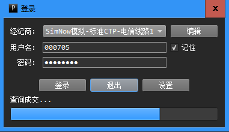

完整的PowerGate包括一个可执行的网关程序，及相应的编程语言SDK。  
用户使用SDK编写交易策略，网关程序加载策略进行交易。

我们将利用PowerGate运行一个非常简单的交易策略，以此讲解它的使用方法。 

## 安装PowerGate网关   
   [点击此处](<https://sourceforge.net/projects/powergate/files/latest/download>)下载PowerGate网关安装程序。  
   网关程序的安装过程与普通应用程序的安装过程一样，它的使用说明请看[这里](terminal/index.html)。   
   PowerGate内置支持多种交易通道，在此我们使用CTP期货模拟通道：一是因为模拟通道可以提供7x24小时服务；二是因为CTP期货通道提供每秒至少两次的Tick数据，我们可以更快地看到策略的运行结果。   
## 安装Python SDK   
   [点击此处](<https://sourceforge.net/projects/powergate-sdk-python/files/latest/download>)下载PowerGate Python SDK。  
   目前SDK支持Win32 Python27。请确保电脑上已经安装了Python27，安装程序[点击此处](<https://www.python.org/ftp/python/2.7.13/python-2.7.13.msi>)下载。
## 编写策略   
   我们编写一个简单的“均线金叉死叉”交易策略。  
   策略原理相当简单：以Tick数据为基础，当10周期均线上穿40周期均线时做多，当10周期均线下穿40周期均线时做空，每次均以对手价下单。（这是一个高效的‘碎钞机’，所以千万别用自己的实盘账号运行这个策略！）  
   打开你喜爱的代码编辑器，复制粘贴下面的代码，并以文件名“macross.py”保存，或者直接到[此处](<https://github.com/algo-trade/powergate-examples-python>)下载代码。
  
		# -*- coding: utf-8 -*- 
		import math
		from PowerGate import StrategyBase     #策略基类
		from PowerGate import StrategyConfig   #策略配置
		from PowerGate import MA               #均线
		from PowerGate import Cross            #均线穿越验证
		
		class MACross(StrategyBase):
		    def __init__(self, *args, **kwargs):
		        super(MACross, self).__init__(*args, **kwargs)
		        self.ma_short = MA()
		        self.ma_long = MA()
		
		    def onStart(self):
				#获取Tick最新价数据序列,Tick数据序列会被系统自动填充
		        self.series = self.getTickSeries().getLastPriceDataSeries()

				#以Tick最新价数据序列和相应周期初始化两根均线
		        self.ma_short.init(self.series, 10)
		        self.ma_long.init(self.series, 40)
		
		    def onTick(self, tick):
				#如果均线还没有可用的计算值，直接返回
				#ma_short的周期参数为10，当Tick最新价数据序列被10个Tick填充时，ma_short获得第一个MA值
		        if math.isnan(self.ma_short[0]):
		            return

				#ma_long的周期参数为40，当Tick最新价数据序列被40个Tick填充时，ma_short获得第一个MA值
		        if math.isnan(self.ma_long[0]):
		            return

				#打印Tick及两条均线的最新值
		        print('CLOSE=%f  MA[10]=%f  MA[40]=%f' % (tick.lastPrice, 
														  self.ma_short[0], 
													      self.ma_long[0]))
				#短均线上穿长均线
		        if Cross.crossAbove(self.ma_short, self.ma_long): 
		            print('Cross Above')
					#以策略订阅的主合约为标的，做多1手
		            self.openLong(self.getMainInstrument(), 1)
				#短均线下穿长均线
		        elif Cross.crossBelow(self.ma_short, self.ma_long): 
		            print('Cross Below')
					#以策略订阅的主合约为标的，做空1手
		            self.openShort(self.getMainInstrument(), 1)
		
		if __name__ == '__main__':
		    config = StrategyConfig()
			#设置策略名称，每个策略必须有一个名称
		    config.setName('MACross')
			#如果只订阅一个合约，那么该合约就是策略主合约，否则第一个订阅的合约为策略主合约
		    config.subscribe("rb1710")
		
			#策略实例
		    strategy = MACross()
			#运行策略  
		    strategy.run(config)         
			#等待用户输入
		    raw_input()
			#停止策略
		    strategy.stop()

## 运行PowerGate网关  
请以CTP模拟账户登录PowerGate网关程序。如果没有模拟账户，请到[SimNow网站](http://www.simnow.com.cn/)注册。

  

## 运行策略  
   网关程序启动完毕，打开命令行窗口，运行交易策略：

		python macross.py
   策略运行时的输出如下：

	
	[2017/05/17 19:00:26.465][I] +===============================================================+
	[2017/05/17 19:00:26.465][I] *   ALGORITHMIC STRATEGY ENGINE [build: May 17 2017 08:22:36]   *
	[2017/05/17 19:00:26.465][I] +===============================================================+
	[2017/05/17 19:00:26.465][I] Engine initializing...
	[2017/05/17 19:00:26.465][W] Could not load data dictionary!
	[2017/05/17 19:00:26.465][I] Load timer service 'SysTimer' done.
	[2017/05/17 19:00:26.465][I] Load market data service 'RemoteMD' done.
	[2017/05/17 19:00:26.465][I] Load order execution service 'RemoteExec' done.
	[2017/05/17 19:00:26.465][I] Total services loaded: 3.
	[2017/05/17 19:00:26.465][I] Load strategy 'MACross' succeed!
	[2017/05/17 19:00:26.465][I] Connect to remote engine at address 127.0.0.1:5501...
	[2017/05/17 19:00:26.554][I] Trading Account Detail [SrvID: 0]:
	=======================================
	     Account ID: xxxxxx
	        Balance: 1284363.160000
	   Realized P/L: 0.000000
	        MTM P/L: 480.000000
	  Client Equity: 1284363.160000
	     Commission: 0.000000
	Margin Occupied: 171002.000000
	     Fund Avail: 988639.160000
	    Risk Degree: 0.000000
	=======================================
	[2017/05/17 19:00:26.555][I] Execution service 'RemoteExec' ready.
	[2017/05/17 19:00:26.555][I] Check auto start...
	[2017/05/17 19:00:26.555][I] Total runtime number: 1.
	[2017/05/17 19:00:26.555][I] Strategy 'MACross' loading...
	CLOSE=2976.000000  MA[10]=2975.900000  MA[40]=2975.550000
	......
	CLOSE=2975.000000  MA[10]=2975.700000  MA[40]=2975.725000
	Cross Below
	[2017/05/17 19:00:55.835][I] [MACross] Raw: Short, rb1710, 1.0, 2975, 2017-05-16 19:49:15.500, 172386781, 1
	[2017/05/17 19:00:55.899][I] [MACross] Raw-Ack: Finished, Short, rb1710, 1.0, 2975, 1.0, 2975, 2017-05-16 19:49:15.500, 172386843, 1
	CLOSE=2975.000000  MA[10]=2975.600000  MA[40]=2975.725000
	......
	CLOSE=2976.000000  MA[10]=2975.900000  MA[40]=2975.800000
	Cross Above
	[2017/05/17 19:01:00.851][I] [MACross] Raw: Cover, rb1710, 1.0, 2977, 2017-05-16 19:49:20.500, 172391796, 2
	[2017/05/17 19:01:00.852][I] [MACross] Raw: Buy, rb1710, 1.0, 2977, 2017-05-16 19:49:20.500, 172391796, 3
	[2017/05/17 19:01:00.903][I] [MACross] Raw-Ack: Finished, Cover, rb1710, 1.0, 2977, 1.0, 2977, 2017-05-16 19:49:20.500, 172391859, 2
	[2017/05/17 19:01:00.904][I] [MACross] Raw-Ack: Finished, Buy, rb1710, 1.0, 2977, 1.0, 2977, 2017-05-16 19:49:20.500, 172391859, 3
	
等待片刻，如果均线有交叉，我们就能看到PowerGate按照策略的指示交易指定合约。在网关界面上我们能看到策略的仓位一直在翻转，因为这是一个时时在场的策略。  
至此，我们已经完成了一个简单的“算法交易策略”的开发与部署。

