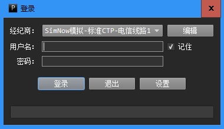
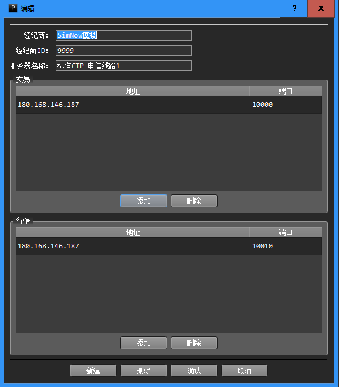
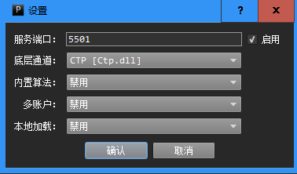
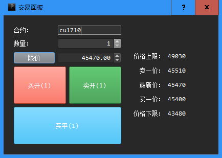
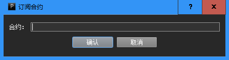
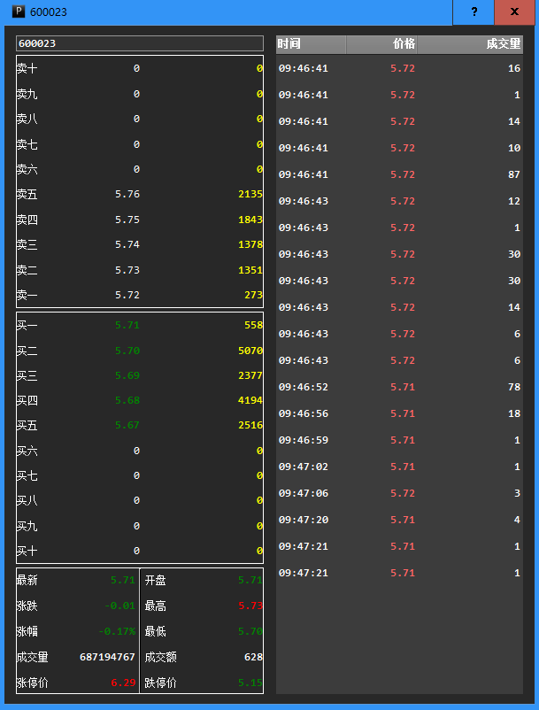

## 安装
网关程序的安装过程与普通程序一样。网关程序[点击此处](https://sourceforge.net/projects/powergate/files/latest/download)下载。  
如果安装之后无法正常启动，提示缺少某个dll，有可能是因为没有安装“Visual C++ Redistributable for Visual Studio 2015”，可以[点击此处](https://www.microsoft.com/zh-CN/download/details.aspx?id=48145)下载安装。
## 登录界面
PowerGate网关程序的登录界面如下所示。
  
   
  
如果用户选中“记住”选项，网关程序会记住用户此次的登录名。
## 编辑经纪商  
点击登录界面的“编辑”按钮，用户可以编辑、删除、创建经纪商配置。  
 
  
  
如果用户需要创建新的经纪商配置，可以点击窗口左下角的“新建”按钮。填写完成所有的配置信息之后，点击“确认”即可。
## 设置选项  
点击登录界面的“设置”按钮，用户可以设置PowerGate网关程序。  

 
  
设置选项包括：

* 服务端口：PowerGate网关的监听商品，默认为5501。
* 底层通道：行情数据及订单执行服务所在的通道。
* 内置算法：是否开启内置算法交易功能。
* 多账户：是否开启多账户支持功能。
* 本地加载：是否开启以动态链接库形式加载策略功能。  

部分选项在一些版本中可能未启用。
## 主界面
PowerGate网关程序运行用户的算法交易策略。在登录账户之后，网关程序的主界面如下图所示。  

  

网关程序主界面上有6个面板，包括：  

* 账户信息面板  
  显示用户的账户信息。  
* 行情数据面板  
  显示用户或策略订阅的行情数据。  
* 策略监控面板  
  在这个面板中，用户可以查看当前加载的策略。通过该面板的相应栏位，用户可以启动、停止策略，查看当前策略的持仓、日志，为策略分配仓位，向策略发送命令等。  
* 报单信息面板  
  显示当前账户的所有报单信息。  
* 日志面板  
  显示网关程序的日志。  
* 持仓面板  
  显示当前账户的所有持仓信息。  

这几个面板可以通过拖拉面板边界显示和隐藏。  
## 交易面板  
在行情面板上双击合约，或者点击“持仓列表”下方的“交易面板”按钮，会弹出“交易面板”。用户可以使用“交易面板”手动交易。  

  
## 行情订阅  
在行情面板中点击右键，在菜单中选择“订阅合约”，会弹出合约订阅窗口，用户输入合约名之后点击确认，PowerGate会尝试订阅指定合约。  
合约订阅成功与否，取决于底层的行情服务是否支持该合约。例如，期货CTP的行情服务就无法订阅股票行情。  

  
## 深度行情
在行情面板中点击右键，在菜单中选择“深度行情”，会弹出深度行情窗口。只有底层的行情服务提供深度行情，窗口中才会显示深度行情数据。  
下图是PowerGate接入兴业证券UT level2行情时，深度行情窗口显示的数据。  

  
